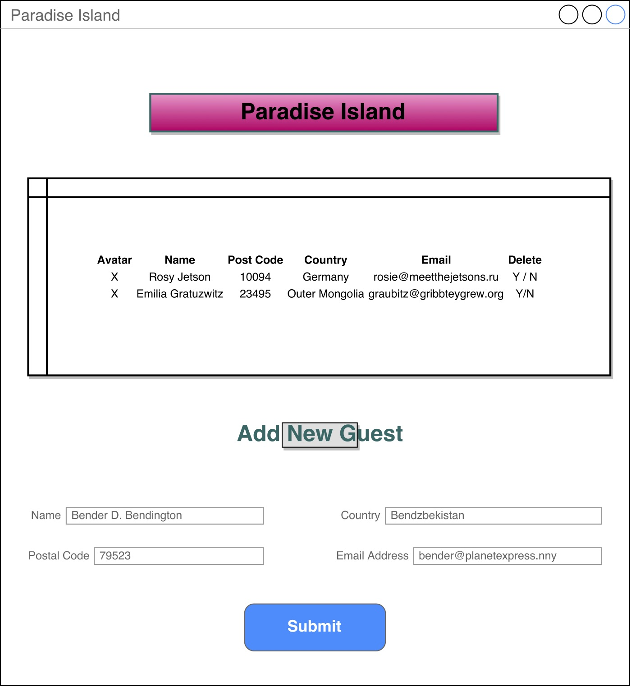

Paradise Island API README
--------------------------

# Introduction

This project is a Rails and AngularJS based API application serving a database of guests that have stayed at Paradise Island. This API includes basic demographic information (home postal code and country), names, email addresses, and avatars. 

#### Log In Information

This application is open to everyone. 

###### https://cryptic-reef-18582.herokuapp.com/

#### Screen Shots

#### Wireframes

#### User Story 

As a supplier of world-class bushing lubricant, I want a list of guests that have recently stayed at Paradise Island, the galaxy's most popular resort among the animatronic. I want to be able to create geographically-based marketing campaigns based on general location, I want my marketing campaigns to be deliverable via email, and I want to personalize my communiques with the guest's name and avatar. I also really like Flamingos .... but only if they're drunk. Can you help me with that as well? 

#### General Approach

My general approach to this assignment was to figure out the API bit first and then go back and add additonal functionality. 

#### Hurdles & Unsolved Problems
**Hurdles:** Getting the form hooked up was a hurdle, as was adding the ability to generate an avatar for each new user.

**Unsolved Problems:** In version 2, I would add functionality for exporting the data to a .csv file, because my bushing lubricant supplier may or may not be tech-saavy.

#### Techonolgies Used

- Ruby on Rails
- Angular JS
- jQuery
- A light end front-end framework (Skeleton)

### Gem Dependencies

- Rails 4.2.6 
- pg 0.15 
- sass-rails 5.0 
- uglifier 1.3.0 
- coffee-rails 4.1.0 
- jquery-rails 
- jbuilder 2.0 
- sdoc 0.4.0 
- byebug 
- web-console 2.0 
- spring 
- faker 
- rails_12factor

### Installation

1. Clone the GitHub repository.

2. Navigate to the main page of the repo and click  
   ⋅⋅**Clone or download**

3. Click the clipboard to copy the clone URL for the repository.

4. Open your CLI.

5. Cd into the location you want the cloned directory to live.

   ⋅⋅ `git clone` and paste the URL you have on the clipboard.
   Hit Enter.

6. To install the database:

   ⋅⋅ run `rake db:migrate`

   ⋅⋅ run `rake db:seed`

### Support

Users looking for support should file an issue on the [GitHub issue tracking page] (https://github.com/cochrancj/Paradise_Island/issues "Git Issue Tracking Page"), **or** [create a pull request] (https://github.com/cochrancj/Paradise_Island/pulls "Create A Pull Request") if you have a fix you would like incorporated.
